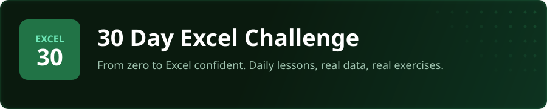
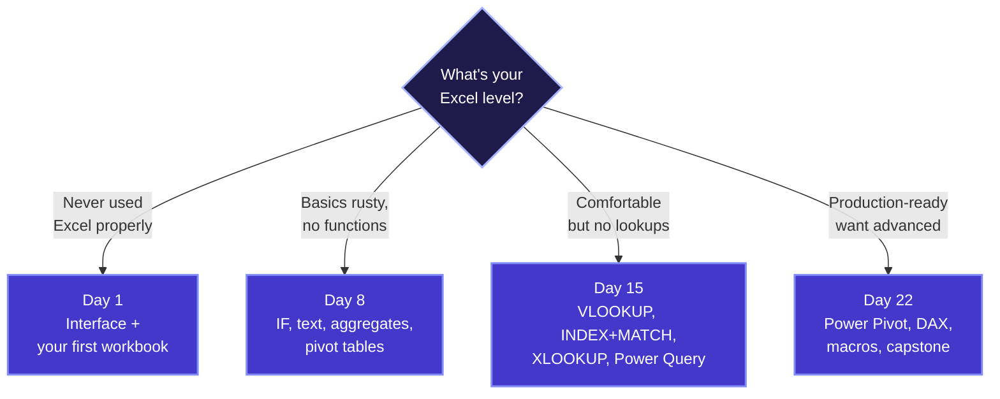
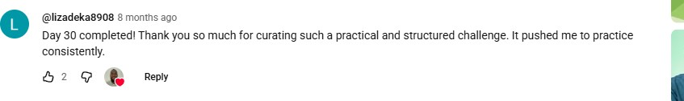

<p align="center">
  <a href="https://www.youtube.com/playlist?list=PL92LwdfbhlXG4E-u5i7ZnLq2HeQYLVnbM"></a>
</p>

<p align="center">
  <a href="https://www.youtube.com/playlist?list=PL92LwdfbhlXG4E-u5i7ZnLq2HeQYLVnbM"></a>
  <a href="https://www.youtube.com/@sdw-online"></a>
  
  
  
</p>

<p align="center">
  <b>By Day 30, you'll be the spreadsheet person on your team.</b><br>
  The one who builds the workbook everyone else uses. The one who finishes in 5 minutes what takes others a day.<br>
  This is the 30-day structure that gets you there - daily lessons, real workbooks, real exercises.
</p>

<!-- PROGRESS-GRID -->
<p align="center"><sub><b>30 OF 30</b> &nbsp;&middot;&nbsp; <i>tap any tile to start watching</i></sub></p>

<table align="center" cellpadding="3" cellspacing="0" border="0">
  <tr>
    <td align="center" valign="middle"><a href="https://www.youtube.com/watch?v=jAryJn2vhNQ" title="Day 1: Getting Started with Excel"></a></td>
    <td align="center" valign="middle"><a href="https://www.youtube.com/watch?v=Ttb1WuotHIs" title="Day 2: Formatting Data for Analysis"></a></td>
    <td align="center" valign="middle"><a href="https://www.youtube.com/watch?v=ggQBWnZUclo" title="Day 3: Formulas & Functions"></a></td>
    <td align="center" valign="middle"><a href="https://www.youtube.com/watch?v=3FZcAIGCB3g" title="Day 4: Sorting & Filtering"></a></td>
    <td align="center" valign="middle"><a href="https://www.youtube.com/watch?v=xo-kVwDqaWc" title="Day 5: Data Visualisation Basics"></a></td>
    <td align="center" valign="middle"><a href="https://www.youtube.com/watch?v=kWVdkiz6-2M" title="Day 6: Conditional Formatting (Part 1)"></a></td>
    <td align="center" valign="middle"><a href="https://www.youtube.com/watch?v=fQMHEIgvv8U" title="Day 7: Project: Week 1 Data Project"></a></td>
    <td align="center" valign="middle"><a href="https://www.youtube.com/watch?v=5oJ5T9o0GJw" title="Day 8: Logical Functions"></a></td>
    <td align="center" valign="middle"><a href="https://www.youtube.com/watch?v=ns1dbkGGt-k" title="Day 9: Text Functions"></a></td>
    <td align="center" valign="middle"><a href="https://www.youtube.com/watch?v=X9N7qNgegZ8" title="Day 10: Aggregate Functions"></a></td>
  </tr>
  <tr>
    <td align="center" valign="middle"><a href="https://www.youtube.com/watch?v=8CPdq6LSF5U" title="Day 11: Pivot Tables (Part 1)"></a></td>
    <td align="center" valign="middle"><a href="https://www.youtube.com/watch?v=iyDYuZAMD9A" title="Day 12: Pivot Tables (Part 2)"></a></td>
    <td align="center" valign="middle"><a href="https://www.youtube.com/watch?v=-Kafb-ypHaM" title="Day 13: Data Validation"></a></td>
    <td align="center" valign="middle"><a href="https://www.youtube.com/watch?v=Y_fwPqS0YHs" title="Day 14: Project: Week 2 Data Project"></a></td>
    <td align="center" valign="middle"><a href="https://www.youtube.com/watch?v=q5IrQWp_Z8E" title="Day 15: Conditional Formatting (Part 2)"></a></td>
    <td align="center" valign="middle"><a href="https://www.youtube.com/watch?v=G6_TYOiv1wg" title="Day 16: VLOOKUP & HLOOKUP"></a></td>
    <td align="center" valign="middle"><a href="https://www.youtube.com/watch?v=mqtgqlj6QMc" title="Day 17: INDEX & MATCH"></a></td>
    <td align="center" valign="middle"><a href="https://www.youtube.com/watch?v=vJf5CWBtA_4" title="Day 18: XLOOKUP"></a></td>
    <td align="center" valign="middle"><a href="https://www.youtube.com/watch?v=RgAOED78C-E" title="Day 19: Data Cleaning"></a></td>
    <td align="center" valign="middle"><a href="https://www.youtube.com/watch?v=R1M2p3kV9mo" title="Day 20: Power Query (Part 1)"></a></td>
  </tr>
  <tr>
    <td align="center" valign="middle"><a href="https://www.youtube.com/watch?v=J7YeXpfXTxI" title="Day 21: Project: Week 3 Data Project"></a></td>
    <td align="center" valign="middle"><a href="https://www.youtube.com/watch?v=FuTsKAqN3NY" title="Day 22: Data Visualisation (Advanced)"></a></td>
    <td align="center" valign="middle"><a href="https://www.youtube.com/watch?v=YykiAwglQFQ" title="Day 23: Dynamic Array Functions"></a></td>
    <td align="center" valign="middle"><a href="https://www.youtube.com/watch?v=JZs-nMaiaPI" title="Day 24: Power Query (Part 2)"></a></td>
    <td align="center" valign="middle"><a href="https://www.youtube.com/watch?v=oD7HE3W8EuY" title="Day 25: Power Pivot & DAX"></a></td>
    <td align="center" valign="middle"><a href="https://www.youtube.com/watch?v=jvjCL3Ht0RQ" title="Day 26: Data Quality & Auditing"></a></td>
    <td align="center" valign="middle"><a href="https://www.youtube.com/watch?v=LVPJCpfrd54" title="Day 27: Macros & VBA Automation"></a></td>
    <td align="center" valign="middle"><a href="https://www.youtube.com/watch?v=zQoKK_-0vUk" title="Day 28: Building a Data-Entry Form"></a></td>
    <td align="center" valign="middle"><a href="https://www.youtube.com/watch?v=hNgZAPLCjwo" title="Day 29: Keyboard Shortcuts"></a></td>
    <td align="center" valign="middle"><a href="https://www.youtube.com/watch?v=lz_JA_t_DSg" title="Day 30: Capstone: Final Data Project"></a></td>
  </tr>
</table>

<p align="center"><sub><i>The whole challenge is live. Tap any tile to start.</i></sub></p>
<!-- /PROGRESS-GRID -->

---

## How it works

Five steps. Every day. Thirty days.


Each day gives you:
- A **video lesson** walking through the concept with real examples
- **Excel workbooks** you open and work with - real files, not screenshots
- **Practice exercises** dropping you into a real role solving a real problem
- A link to the **next day** so you always know what's coming

### Getting the files (new to GitHub?)

Each day's Excel files live in that day's folder - the example workbook (e.g. `day5_examples.xlsx`) plus a `practice/` folder with the challenge workbook. Open a `day_XX_...` folder to see them. To get them onto your machine, pick one:

- **Download everything (easiest):** click the green **Code** button near the top of this page, then **Download ZIP**. Unzip it and open the folder for the day you are on.
- **Download one workbook:** click into a `day_XX_...` folder, click the `.xlsx` file, then click the **Download** (or **Download raw file**) button - GitHub cannot preview Excel files, so this is expected.
- **Clone (if you have Git):** run `git clone https://github.com/sdw-online/30-Day-Excel-Challenge.git` in your terminal.

---

## Why This Challenge?

<p align="center">
  <a href="guides/why-this-challenge.md"></a>
</p>

**You don't get good at Excel by watching someone else click through a spreadsheet.** You get good by building workbooks yourself, every day, with data you can actually see and manipulate. That's what this challenge is built around - not theory, not slides, just you and a spreadsheet.

**30 minutes a day beats a weekend bootcamp.** It's tempting to binge-watch a 14-hour course on a Saturday and call it done. But that's exposure, not skill. When you open Excel every single day for 30 days, the keyboard shortcuts become muscle memory, the formulas become second nature, and pivot tables stop being scary.

**Every exercise puts you in a real job.** You're not doing textbook drills. You're an analyst building an expense report. You're cleaning messy HR data. You're building a dashboard for a client presentation. The scenarios are modelled on real work - so when you do land that role, nothing feels unfamiliar.

---

## "But can't AI build spreadsheets for me?"

<p align="center">
  <a href="guides/excel-in-the-ai-era.md"></a>
</p>

Sure, AI can generate formulas. But here's what it can't do: verify the formula references the right cells, check that your data doesn't have hidden duplicates, or spot that a VLOOKUP is returning the wrong column because someone inserted a new one last Tuesday.

But honestly, the AI argument misses the bigger picture. Excel isn't just a tool you use - it's a way of thinking:

- **It teaches you to structure data.** Every messy dataset forces you to think about what clean looks like. That's a skill that transfers to databases, Python, and any data tool you'll ever use.
- **It teaches you to be systematic.** One wrong cell reference cascades through an entire workbook. You learn to build things carefully, check your assumptions, and trace errors to their source.
- **It gives you immediate power.** The moment you can open a CSV and turn it into an insight in 5 minutes, you become the most useful person in any meeting.

AI makes Excel faster. This challenge makes you someone who knows what to build - and when AI gets it wrong.

---

## Where should I start?

Not everyone's starting from scratch - and that's fine. Pick the door that matches where you are.



<sub><i>Click any node to jump straight to that day's folder.</i></sub>

If diagrams don't render in your client, here's the short version:

- **Never used Excel properly?** → [Day 1](./day_01_getting_started) - interface + your first workbook
- **Basics rusty?** → [Day 8](./day_08_logical_functions) - IF, text, aggregates, pivot tables
- **Comfortable but no lookups?** → [Day 15](./day_15_conditional_formatting_2) - VLOOKUP, INDEX+MATCH, XLOOKUP, Power Query
- **Already use Excel at work?** → [Day 22](./day_22_data_viz_advanced) - Power Pivot, DAX, macros, capstone

---

<p align="center">
  <a href="https://30dayexcelchallenge.carrd.co/"></a>
</p>

---

## Curriculum

<br>

<a href="day_01_getting_started/"></a>

<br>

| Day | Topic | What You'll Do | Video |
|:---:|-------|----------------|:-----:|
| 01 | Getting Started with Excel | Learn the interface, create your first workbook, and enter data<br><sub><i>The 30 minutes that decide whether you finish the challenge.</i></sub> | [Watch](https://www.youtube.com/watch?v=jAryJn2vhNQ) |
| 02 | Formatting Data for Analysis | Format numbers, dates, and cells so your data is easy to read and analyse<br><sub><i>Bad charts hide insight. Good ones force it.</i></sub> | [Watch](https://www.youtube.com/watch?v=Ttb1WuotHIs) |
| 03 | Formulas & Functions | Write your first formulas - SUM, AVERAGE, MAX, MIN - and understand cell references<br><sub><i>Forms turn spreadsheets into apps.</i></sub> | [Watch](https://www.youtube.com/watch?v=ggQBWnZUclo) |
| 04 | Sorting & Filtering | Sort data by any column and use filters to find exactly what you need<br><sub><i>The single most-used SQL clause. Get it wrong, get nothing.</i></sub> | [Watch](https://www.youtube.com/watch?v=3FZcAIGCB3g) |
| 05 | Data Visualisation Basics | Build column, bar, line, and pie charts that actually communicate clearly<br><sub><i>Bad charts hide insight. Good ones force it.</i></sub> | [Watch](https://www.youtube.com/watch?v=xo-kVwDqaWc) |
| 06 | Conditional Formatting (Part 1) | Highlight cells automatically based on rules - data bars, colour scales, icon sets<br><sub><i>Bad charts hide insight. Good ones force it.</i></sub> | [Watch](https://www.youtube.com/watch?v=kWVdkiz6-2M) |
| 07 | **Project:** Week 1 Data Project | Put it all together - build a complete analysis from a real dataset<br><sub><i>The day you stop learning and start building.</i></sub> | [Watch](https://www.youtube.com/watch?v=fQMHEIgvv8U) |

<br>

<a href="day_08_logical_functions/"></a>

<br>

| Day | Topic | What You'll Do | Video |
|:---:|-------|----------------|:-----:|
| 08 | Logical Functions | Use IF, IFS, AND, OR to add conditional logic to your spreadsheets<br><sub><i>Logical Functions - the thing most people get wrong.</i></sub> | [Watch](https://www.youtube.com/watch?v=5oJ5T9o0GJw) |
| 09 | Text Functions | Clean and extract text with LEFT, RIGHT, MID, TRIM, and CONCATENATE<br><sub><i>Messy text is everywhere. The fix is one chapter away.</i></sub> | [Watch](https://www.youtube.com/watch?v=ns1dbkGGt-k) |
| 10 | Aggregate Functions | Use SUMIFS, COUNTIFS, AVERAGEIFS to summarise data with multiple conditions<br><sub><i>Aggregates have one trap that turns reports into lies.</i></sub> | [Watch](https://www.youtube.com/watch?v=X9N7qNgegZ8) |
| 11 | Pivot Tables (Part 1) | Create pivot tables to summarise thousands of rows in seconds<br><sub><i>Pivot tables eat hours of manual work in seconds.</i></sub> | [Watch](https://www.youtube.com/watch?v=8CPdq6LSF5U) |
| 12 | Pivot Tables (Part 2) | Add slicers, calculated fields, pivot charts, and learn refresh logic<br><sub><i>Pivot tables eat hours of manual work in seconds.</i></sub> | [Watch](https://www.youtube.com/watch?v=iyDYuZAMD9A) |
| 13 | Data Validation | Build drop-down lists and input rules to control what users can enter<br><sub><i>Clean data is not glamorous. It is the difference between right and very wrong.</i></sub> | [Watch](https://www.youtube.com/watch?v=-Kafb-ypHaM) |
| 14 | **Project:** Week 2 Data Project | Combine functions and pivot tables into a complete analytical report<br><sub><i>The day you stop learning and start building.</i></sub> | [Watch](https://www.youtube.com/watch?v=Y_fwPqS0YHs) |

<br>

<a href="day_15_conditional_formatting_2/"></a>

<br>

| Day | Topic | What You'll Do | Video |
|:---:|-------|----------------|:-----:|
| 15 | Conditional Formatting (Part 2) | Write custom formulas for advanced highlighting - row-level rules and dynamic patterns<br><sub><i>Bad charts hide insight. Good ones force it.</i></sub> | [Watch](https://www.youtube.com/watch?v=q5IrQWp_Z8E) |
| 16 | VLOOKUP & HLOOKUP | Look up values across sheets and understand exact vs approximate matching<br><sub><i>Lookups separate the spreadsheet person from everyone else.</i></sub> | [Watch](https://www.youtube.com/watch?v=G6_TYOiv1wg) |
| 17 | INDEX & MATCH | The flexible alternative to VLOOKUP - left lookups, two-way lookups, no column counting<br><sub><i>Lookups separate the spreadsheet person from everyone else.</i></sub> | [Watch](https://www.youtube.com/watch?v=mqtgqlj6QMc) |
| 18 | XLOOKUP | The modern replacement for VLOOKUP - simpler syntax, multiple returns, wildcards<br><sub><i>Lookups separate the spreadsheet person from everyone else.</i></sub> | [Watch](https://www.youtube.com/watch?v=vJf5CWBtA_4) |
| 19 | Data Cleaning | Fix messy data with Find & Replace, Remove Duplicates, Text to Columns, and Flash Fill<br><sub><i>Clean data is not glamorous. It is the difference between right and very wrong.</i></sub> | [Watch](https://www.youtube.com/watch?v=RgAOED78C-E) |
| 20 | Power Query (Part 1) | Automate data imports and transformations with Get & Transform<br><sub><i>Where Excel stops being a spreadsheet and starts being a database.</i></sub> | [Watch](https://www.youtube.com/watch?v=R1M2p3kV9mo) |
| 21 | **Project:** Week 3 Data Project | Build a lookup-powered, cleaned data pipeline with a polished output<br><sub><i>The day you stop learning and start building.</i></sub> | [Watch](https://www.youtube.com/watch?v=J7YeXpfXTxI) |

<br>

<a href="day_22_data_viz_advanced/"></a>

<br>

| Day | Topic | What You'll Do | Video |
|:---:|-------|----------------|:-----:|
| 22 | Data Visualisation (Advanced) | Build combo charts, sparklines, and dynamic dashboard layouts<br><sub><i>Bad charts hide insight. Good ones force it.</i></sub> | [Watch](https://www.youtube.com/watch?v=FuTsKAqN3NY) |
| 23 | Dynamic Array Functions | Use FILTER, SORT, SORTBY, UNIQUE to build live-updating outputs<br><sub><i>One formula. A whole spilled range. The future of Excel.</i></sub> | [Watch](https://www.youtube.com/watch?v=YykiAwglQFQ) |
| 24 | Power Query (Part 2) | Merge and append queries, add custom columns, and use parameters<br><sub><i>Where Excel stops being a spreadsheet and starts being a database.</i></sub> | [Watch](https://www.youtube.com/watch?v=JZs-nMaiaPI) |
| 25 | Power Pivot & DAX | Build a data model with relationships and write DAX measures<br><sub><i>Pivot tables eat hours of manual work in seconds.</i></sub> | [Watch](https://www.youtube.com/watch?v=oD7HE3W8EuY) |
| 26 | Data Quality & Auditing | Check for errors, audit formulas, profile your data, and set quality rules<br><sub><i>Clean data is not glamorous. It is the difference between right and very wrong.</i></sub> | [Watch](https://www.youtube.com/watch?v=jvjCL3Ht0RQ) |
| 27 | Macros & VBA Automation | Record macros, learn VBA basics, and automate repetitive tasks<br><sub><i>Automate it once. Save the time forever.</i></sub> | [Watch](https://www.youtube.com/watch?v=LVPJCpfrd54) |
| 28 | Building a Data-Entry Form | Create a user-friendly form with controls, validation, and auto-population<br><sub><i>Forms turn spreadsheets into apps.</i></sub> | [Watch](https://www.youtube.com/watch?v=zQoKK_-0vUk) |
| 29 | Keyboard Shortcuts | The shortcuts that save you hours every week - navigation, selection, formatting<br><sub><i>The shortcuts pros use without thinking. You will too.</i></sub> | [Watch](https://www.youtube.com/watch?v=hNgZAPLCjwo) |
| 30 | **Capstone:** Final Data Project | Build a complete analytics platform - data pipeline, dashboard, presentation-ready<br><sub><i>The day you stop learning and start building.</i></sub> | [Watch](https://www.youtube.com/watch?v=lz_JA_t_DSg) |

---

## Quick Start

**All you need is a computer and Microsoft Excel.** That's it.

**Step 1** - Get Excel ([Microsoft 365](https://www.microsoft.com/en-gb/microsoft-365) or [Excel for the web](https://www.office.com/launch/excel) - free with a Microsoft account)

**Step 2** - Clone this repo
```bash
git clone https://github.com/sdw-online/30-Day-Excel-Challenge.git
```

**Step 3** - Open [`day_01_getting_started/`](day_01_getting_started/) and you're off

---

## What People Are Saying

Real comments from people doing the challenge.

<p align="center">
  
  &nbsp;&nbsp;
  
</p>

<p align="center">
  
  &nbsp;&nbsp;
  
</p>

<p align="center">
  
  &nbsp;&nbsp;
  
</p>

<p align="center">
  
  &nbsp;&nbsp;
  
</p>

<p align="center">
  
</p>

---

<!-- BROWSE-ALL-VIDEOS -->
## Browse all videos

<sub>Click any thumbnail to jump straight to that day's video on YouTube. Sorted by day number.</sub>

<table>
<tr>
<td align="center" width="33%">
  <a href="https://www.youtube.com/watch?v=jAryJn2vhNQ"></a><br/>
  <sub><b>Day 01 - Getting Started with Excel</b></sub>
</td>
<td align="center" width="33%">
  <a href="https://www.youtube.com/watch?v=Ttb1WuotHIs"></a><br/>
  <sub><b>Day 02 - Formatting Data for Analysis</b></sub>
</td>
<td align="center" width="33%">
  <a href="https://www.youtube.com/watch?v=ggQBWnZUclo"></a><br/>
  <sub><b>Day 03 - Formulas &amp; Functions</b></sub>
</td>
</tr>
<tr>
<td align="center" width="33%">
  <a href="https://www.youtube.com/watch?v=3FZcAIGCB3g"></a><br/>
  <sub><b>Day 04 - Sorting &amp; Filtering</b></sub>
</td>
<td align="center" width="33%">
  <a href="https://www.youtube.com/watch?v=xo-kVwDqaWc"></a><br/>
  <sub><b>Day 05 - Data Visualisation Basics</b></sub>
</td>
<td align="center" width="33%">
  <a href="https://www.youtube.com/watch?v=kWVdkiz6-2M"></a><br/>
  <sub><b>Day 06 - Conditional Formatting (Part 1)</b></sub>
</td>
</tr>
<tr>
<td align="center" width="33%">
  <a href="https://www.youtube.com/watch?v=fQMHEIgvv8U"></a><br/>
  <sub><b>Day 07 - Project: Week 1 Data Project</b></sub>
</td>
<td align="center" width="33%">
  <a href="https://www.youtube.com/watch?v=5oJ5T9o0GJw"></a><br/>
  <sub><b>Day 08 - Logical Functions</b></sub>
</td>
<td align="center" width="33%">
  <a href="https://www.youtube.com/watch?v=ns1dbkGGt-k"></a><br/>
  <sub><b>Day 09 - Text Functions</b></sub>
</td>
</tr>
<tr>
<td align="center" width="33%">
  <a href="https://www.youtube.com/watch?v=X9N7qNgegZ8"></a><br/>
  <sub><b>Day 10 - Aggregate Functions</b></sub>
</td>
<td align="center" width="33%">
  <a href="https://www.youtube.com/watch?v=8CPdq6LSF5U"></a><br/>
  <sub><b>Day 11 - Pivot Tables (Part 1)</b></sub>
</td>
<td align="center" width="33%">
  <a href="https://www.youtube.com/watch?v=iyDYuZAMD9A"></a><br/>
  <sub><b>Day 12 - Pivot Tables (Part 2)</b></sub>
</td>
</tr>
<tr>
<td align="center" width="33%">
  <a href="https://www.youtube.com/watch?v=-Kafb-ypHaM"></a><br/>
  <sub><b>Day 13 - Data Validation</b></sub>
</td>
<td align="center" width="33%">
  <a href="https://www.youtube.com/watch?v=Y_fwPqS0YHs"></a><br/>
  <sub><b>Day 14 - Project: Week 2 Data Project</b></sub>
</td>
<td align="center" width="33%">
  <a href="https://www.youtube.com/watch?v=q5IrQWp_Z8E"></a><br/>
  <sub><b>Day 15 - Conditional Formatting (Part 2)</b></sub>
</td>
</tr>
<tr>
<td align="center" width="33%">
  <a href="https://www.youtube.com/watch?v=G6_TYOiv1wg"></a><br/>
  <sub><b>Day 16 - VLOOKUP &amp; HLOOKUP</b></sub>
</td>
<td align="center" width="33%">
  <a href="https://www.youtube.com/watch?v=mqtgqlj6QMc"></a><br/>
  <sub><b>Day 17 - INDEX &amp; MATCH</b></sub>
</td>
<td align="center" width="33%">
  <a href="https://www.youtube.com/watch?v=vJf5CWBtA_4"></a><br/>
  <sub><b>Day 18 - XLOOKUP</b></sub>
</td>
</tr>
<tr>
<td align="center" width="33%">
  <a href="https://www.youtube.com/watch?v=RgAOED78C-E"></a><br/>
  <sub><b>Day 19 - Data Cleaning</b></sub>
</td>
<td align="center" width="33%">
  <a href="https://www.youtube.com/watch?v=R1M2p3kV9mo"></a><br/>
  <sub><b>Day 20 - Power Query (Part 1)</b></sub>
</td>
<td align="center" width="33%">
  <a href="https://www.youtube.com/watch?v=J7YeXpfXTxI"></a><br/>
  <sub><b>Day 21 - Project: Week 3 Data Project</b></sub>
</td>
</tr>
<tr>
<td align="center" width="33%">
  <a href="https://www.youtube.com/watch?v=FuTsKAqN3NY"></a><br/>
  <sub><b>Day 22 - Data Visualisation (Advanced)</b></sub>
</td>
<td align="center" width="33%">
  <a href="https://www.youtube.com/watch?v=YykiAwglQFQ"></a><br/>
  <sub><b>Day 23 - Dynamic Array Functions</b></sub>
</td>
<td align="center" width="33%">
  <a href="https://www.youtube.com/watch?v=JZs-nMaiaPI"></a><br/>
  <sub><b>Day 24 - Power Query (Part 2)</b></sub>
</td>
</tr>
<tr>
<td align="center" width="33%">
  <a href="https://www.youtube.com/watch?v=oD7HE3W8EuY"></a><br/>
  <sub><b>Day 25 - Power Pivot &amp; DAX</b></sub>
</td>
<td align="center" width="33%">
  <a href="https://www.youtube.com/watch?v=jvjCL3Ht0RQ"></a><br/>
  <sub><b>Day 26 - Data Quality &amp; Auditing</b></sub>
</td>
<td align="center" width="33%">
  <a href="https://www.youtube.com/watch?v=LVPJCpfrd54"></a><br/>
  <sub><b>Day 27 - Macros &amp; VBA Automation</b></sub>
</td>
</tr>
<tr>
<td align="center" width="33%">
  <a href="https://www.youtube.com/watch?v=zQoKK_-0vUk"></a><br/>
  <sub><b>Day 28 - Building a Data-Entry Form</b></sub>
</td>
<td align="center" width="33%">
  <a href="https://www.youtube.com/watch?v=hNgZAPLCjwo"></a><br/>
  <sub><b>Day 29 - Keyboard Shortcuts</b></sub>
</td>
<td align="center" width="33%">
  <a href="https://www.youtube.com/watch?v=lz_JA_t_DSg"></a><br/>
  <sub><b>Day 30 - Capstone: Final Data Project</b></sub>
</td>
</tr>
</table>

<!-- BROWSE-ALL-VIDEOS -->

---

## Join the community

<p align="center">
  <a href="https://30dayexcelchallenge.carrd.co/"><strong>Get the 30 Day Excel Challenge lead magnet →</strong></a><br/>
  <sub>The structured walkthrough, datasets, and bonus material - straight to your inbox.</sub>
</p>

<p align="center">
  <sub>Want broader data content too? <a href="https://data100x.carrd.co/">Join the free data community →</a></sub>
</p>

<p align="center"><sub>
  Want the deeper material? <a href="https://davidwilliams2.gumroad.com/l/rlrkqua"><b>Excel Made Easy</b></a> on Gumroad.
</sub></p>

---

<p align="center">
  <a href="https://www.youtube.com/@sdw-online?sub_confirmation=1"></a>
</p>

You just mass-gained a skill most people spend months fumbling through. Stephen drops new challenges, projects, and deep dives regularly - [subscribe on YouTube](https://www.youtube.com/@sdw-online?sub_confirmation=1) so you don't miss the next one.

That's how people go from "learning Excel" to being the spreadsheet person everyone asks for help.

---

## Other Installation Guides

Need to set up other tools? These walk you through each one step by step:

| Tool | Guide |
|------|:-----:|
| PostgreSQL & pgAdmin | [Watch](https://youtu.be/g8GwhsVPaOg) |
| MySQL & Workbench | [Watch](https://youtu.be/u8gGLYOhJuA) |
| SQL Server & SSMS | [Watch](https://youtu.be/Th0hB2h7F14) |
| VS Code | [Watch](https://youtu.be/ny-uBrcGP_U) |
| Git | [Watch](https://youtu.be/26moiTYEw6I) |
| Docker | [Watch](https://youtu.be/6KWp6pNAVLU) |

---

## About

I'm Stephen - a Senior Data Engineer who's worked across consulting, startups, and enterprise (BDO, TCS, easyJet, C. Hoare & Co., Veolia UK/US).

I've spent years doing this work professionally, and I created this challenge to pass on what I've learnt - the practical stuff, not the theory. The kind of Excel you actually use on the job. Thousands of people have gone through this challenge already, and watching people message me saying they got their first data role because of these videos is genuinely why I keep doing it.

**YouTube:** [Stephen | Data](https://www.youtube.com/@sdw-online?sub_confirmation=1)

---

## License

For educational purposes. Fork it, clone it, learn from it. If you share it, a link back is appreciated.
