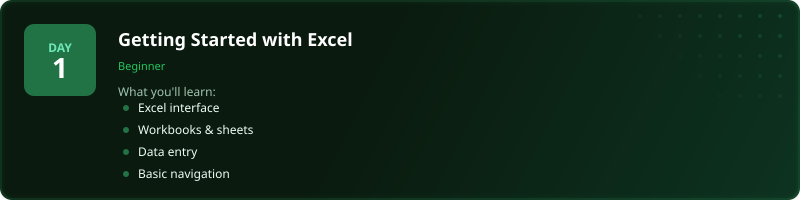
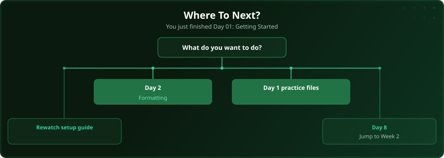

  

  
  
  
  

# Day 1 - Getting Started with Excel

Start of challenge | [Day 2: Formatting Data for Analysis >>](../day_02_formatting_for_analysis/)

---

## What You'll Learn

- Excel interface and navigation
- Creating workbooks and worksheets
- Entering and editing data
- Saving and organising files

---

## Files

Open the files in this folder and follow along with the [video lesson](https://www.youtube.com/watch?v=jAryJn2vhNQ).

---

## Where To Next?

  

---

  <a href="../day_02_formatting_for_analysis/">Day 2: Formatting Data for Analysis &#9654;</a>

