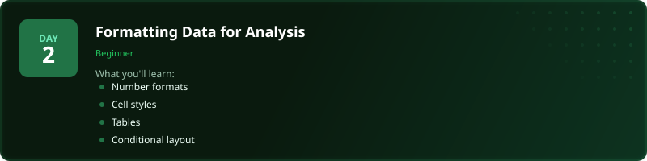
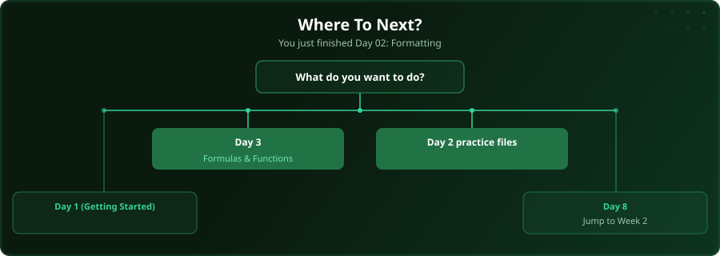

  

  
  
  
  

# Day 2 - Formatting Data for Analysis

[<< Day 1: Getting Started with Excel](../day_01_getting_started/) | [Day 3: Formulas & Functions >>](../day_03_formulas_and_functions/)

---

## What You'll Learn

- Number and date formats
- Cell styles and themes
- Converting ranges to tables
- Formatting for readability

---

## Files

Open the example workbook in this folder and follow along with the [video lesson](https://www.youtube.com/watch?v=Ttb1WuotHIs). Then test yourself with the challenge in the [`practice/`](practice/) folder.

---

## Where To Next?

  

---

  <a href="../day_01_getting_started/">&#9664; Day 1: Getting Started with Excel</a> &nbsp;&nbsp;|&nbsp;&nbsp; <a href="../day_03_formulas_and_functions/">Day 3: Formulas & Functions &#9654;</a>

---

<!-- CLIFFHANGER -->

<b>UP NEXT</b>

<b>Day 3 &nbsp;&middot;&nbsp; Formulas & Functions</b>

<i>Forms turn spreadsheets into apps.</i>

<!-- /CLIFFHANGER -->
