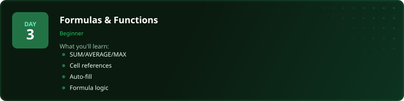
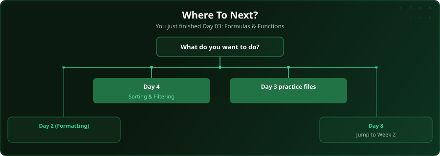

  

  
  
  
  

# Day 3 - Formulas & Functions

[<< Day 2: Formatting Data for Analysis](../day_02_formatting_for_analysis/) | [Day 4: Sorting & Filtering >>](../day_04_sorting_and_filtering/)

---

## What You'll Learn

- SUM, AVERAGE, MAX, MIN, COUNT
- Relative and absolute cell references
- Auto-fill and formula logic
- Common formula errors

---

## Files

Open the example workbook in this folder and follow along with the [video lesson](https://www.youtube.com/watch?v=ggQBWnZUclo). Then test yourself with the challenge in the [`practice/`](practice/) folder. When you are done, check your work against the solution workbook [`practice/Day03_Practice_Solution.xlsx`](practice/Day03_Practice_Solution.xlsx) in that folder.

---

## Where To Next?

  

---

  <a href="../day_02_formatting_for_analysis/">&#9664; Day 2: Formatting Data for Analysis</a> &nbsp;&nbsp;|&nbsp;&nbsp; <a href="../day_04_sorting_and_filtering/">Day 4: Sorting & Filtering &#9654;</a>

---

<!-- CLIFFHANGER -->

<b>UP NEXT</b>

<b>Day 4 &nbsp;&middot;&nbsp; Sorting & Filtering</b>

<i>The single most-used SQL clause. Get it wrong, get nothing.</i>

<!-- /CLIFFHANGER -->
