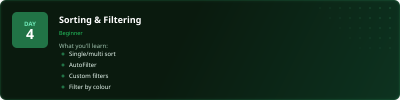
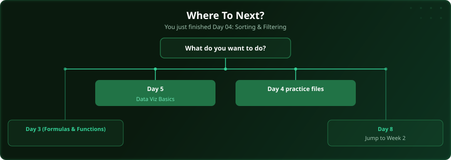

  

  
  
  
  

# Day 4 - Sorting & Filtering

[<< Day 3: Formulas & Functions](../day_03_formulas_and_functions/) | [Day 5: Data Visualisation Basics >>](../day_05_data_viz_basics/)

---

## What You'll Learn

- Single and multi-level sorting
- AutoFilter for quick filtering
- Custom and advanced filters
- Filtering by colour and icon

---

## Files

Open the example workbook in this folder and follow along with the [video lesson](https://www.youtube.com/watch?v=3FZcAIGCB3g). Then test yourself with the challenge in the [`practice/`](practice/) folder.

---

## Where To Next?

  

---

  <a href="../day_03_formulas_and_functions/">&#9664; Day 3: Formulas & Functions</a> &nbsp;&nbsp;|&nbsp;&nbsp; <a href="../day_05_data_viz_basics/">Day 5: Data Visualisation Basics &#9654;</a>

---

<!-- CLIFFHANGER -->

<b>UP NEXT</b>

<b>Day 5 &nbsp;&middot;&nbsp; Data Visualisation Basics</b>

<i>Bad charts hide insight. Good ones force it.</i>

<!-- /CLIFFHANGER -->
