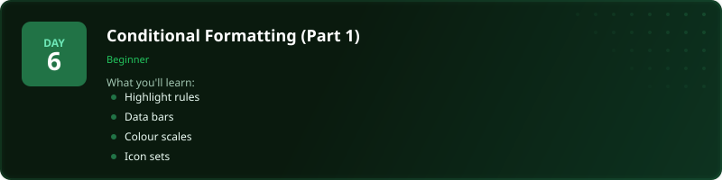
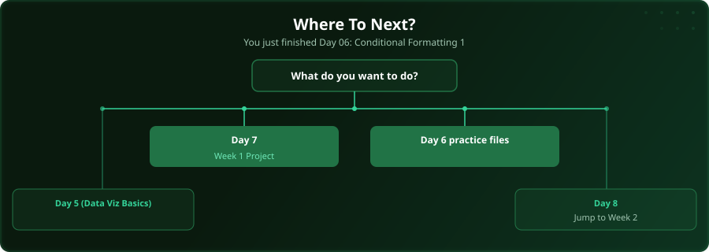

  

  
  
  
  

# Day 6 - Conditional Formatting (Part 1)

[<< Day 5: Data Visualisation Basics](../day_05_data_viz_basics/) | [Day 7: Project: Week 1 Data Project >>](../day_07_week1_practice/)

---

## What You'll Learn

- Highlight cell rules
- Data bars for visual comparison
- Colour scales for gradients
- Icon sets for status indicators

---

## Files

Open the files in this folder and follow along with the [video lesson](https://www.youtube.com/watch?v=kWVdkiz6-2M).

---

## Where To Next?

  

---

  <a href="../day_05_data_viz_basics/">&#9664; Day 5: Data Visualisation Basics</a> &nbsp;&nbsp;|&nbsp;&nbsp; <a href="../day_07_week1_practice/">Day 7: Project: Week 1 Data Project &#9654;</a>

