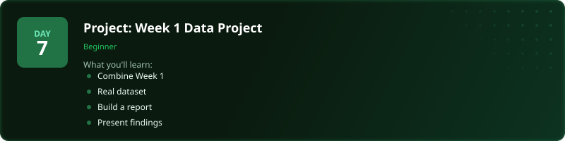
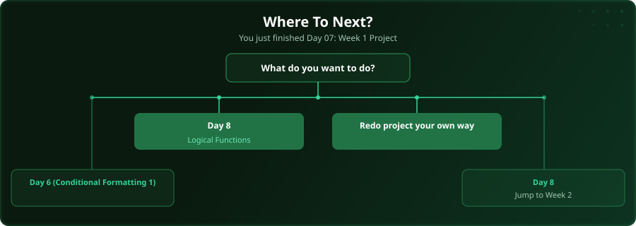

  

  
  
  
  

# Day 7 - Project: Week 1 Data Project

[<< Day 6: Conditional Formatting (Part 1)](../day_06_conditional_formatting_1/) | [Day 8: Logical Functions (IF, IFS, AND, OR) >>](../day_08_logical_functions/)

---

## What You'll Learn

- Combine everything from Week 1
- Work with a real dataset
- Build a complete report
- Present your findings

---

## Files

Open the files in this folder and follow along with the [video lesson](https://www.youtube.com/watch?v=fQMHEIgvv8U).

---

  

## Where To Next?

  

---

  <a href="../day_06_conditional_formatting_1/">&#9664; Day 6: Conditional Formatting (Part 1)</a> &nbsp;&nbsp;|&nbsp;&nbsp; <a href="../day_08_logical_functions/">Day 8: Logical Functions (IF, IFS, AND, OR) &#9654;</a>

---

<!-- CLIFFHANGER -->

<b>UP NEXT</b>

<b>Day 8 &nbsp;&middot;&nbsp; Logical Functions</b>

<i>Logical Functions - the thing most people get wrong.</i>

<!-- /CLIFFHANGER -->
