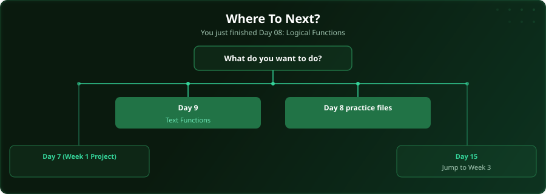

  

  
  
  
  

# Day 8 - Logical Functions (IF, IFS, AND, OR)

[<< Day 7: Project: Week 1 Data Project](../day_07_week1_practice/) | [Day 9: Text Functions >>](../day_09_text_functions/)

---

## What You'll Learn

- IF function for conditional logic
- Nested IF and IFS for multiple conditions
- AND/OR for combining tests
- IFERROR for handling errors

---

## Files

Open the files in this folder and follow along with the [video lesson](https://www.youtube.com/watch?v=5oJ5T9o0GJw).

---

## Where To Next?

  

---

  <a href="../day_07_week1_practice/">&#9664; Day 7: Project: Week 1 Data Project</a> &nbsp;&nbsp;|&nbsp;&nbsp; <a href="../day_09_text_functions/">Day 9: Text Functions &#9654;</a>

---

<!-- CLIFFHANGER -->

<b>UP NEXT</b>

<b>Day 9 &nbsp;&middot;&nbsp; Text Functions</b>

<i>Messy text is everywhere. The fix is one chapter away.</i>

<!-- /CLIFFHANGER -->
