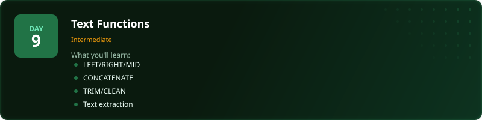
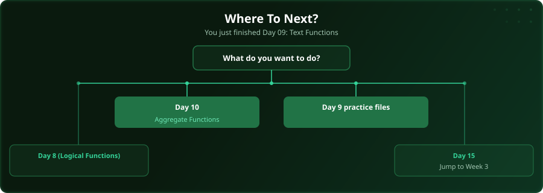

  

  
  
  
  

# Day 9 - Text Functions

[<< Day 8: Logical Functions (IF, IFS, AND, OR)](../day_08_logical_functions/) | [Day 10: Aggregate Functions >>](../day_10_aggregate_functions/)

---

## What You'll Learn

- LEFT, RIGHT, MID for extraction
- CONCATENATE and TEXTJOIN
- TRIM, CLEAN for whitespace
- LEN, FIND, SUBSTITUTE

---

## Files

Open the example workbook in this folder and follow along with the [video lesson](https://www.youtube.com/watch?v=ns1dbkGGt-k). Then test yourself with the challenge in the [`practice/`](practice/) folder. When you are done, check your work against the solution workbook [`practice/Day09_Practice_Solution.xlsx`](practice/Day09_Practice_Solution.xlsx) in that folder.

---

## Where To Next?

  

---

  <a href="../day_08_logical_functions/">&#9664; Day 8: Logical Functions (IF, IFS, AND, OR)</a> &nbsp;&nbsp;|&nbsp;&nbsp; <a href="../day_10_aggregate_functions/">Day 10: Aggregate Functions &#9654;</a>

---

<!-- CLIFFHANGER -->

<b>UP NEXT</b>

<b>Day 10 &nbsp;&middot;&nbsp; Aggregate Functions</b>

<i>Aggregates have one trap that turns reports into lies.</i>

<!-- /CLIFFHANGER -->
