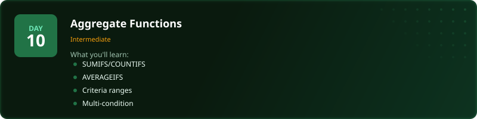
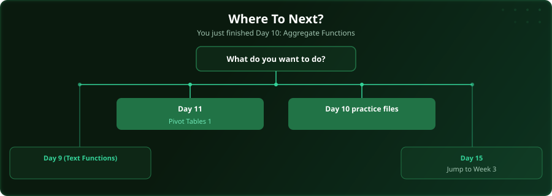

  

  
  
  
  

# Day 10 - Aggregate Functions

[<< Day 9: Text Functions](../day_09_text_functions/) | [Day 11: Pivot Tables (Part 1) >>](../day_11_pivot_tables_1/)

---

## What You'll Learn

- SUMIFS with multiple criteria
- COUNTIFS for conditional counting
- AVERAGEIFS for filtered averages
- Combining conditions effectively

---

## Files

Open the files in this folder and follow along with the [video lesson](https://www.youtube.com/watch?v=X9N7qNgegZ8).

---

  

## Where To Next?

  

---

  <a href="../day_09_text_functions/">&#9664; Day 9: Text Functions</a> &nbsp;&nbsp;|&nbsp;&nbsp; <a href="../day_11_pivot_tables_1/">Day 11: Pivot Tables (Part 1) &#9654;</a>

