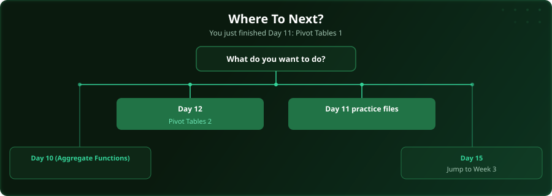

  

  
  
  
  

# Day 11 - Pivot Tables (Part 1)

[<< Day 10: Aggregate Functions](../day_10_aggregate_functions/) | [Day 12: Pivot Tables (Part 2) >>](../day_12_pivot_tables_2/)

---

## What You'll Learn

- Creating your first pivot table
- Dragging fields to rows and columns
- Changing value field settings
- Grouping dates and numbers

---

## Files

Open the example workbook in this folder and follow along with the [video lesson](https://www.youtube.com/watch?v=8CPdq6LSF5U). Then test yourself with the challenge in the [`practice/`](practice/) folder. When you are done, check your work against the solution workbook [`practice/Day11_Practice_Solution.xlsx`](practice/Day11_Practice_Solution.xlsx) in that folder.

---

## Where To Next?

  

---

  <a href="../day_10_aggregate_functions/">&#9664; Day 10: Aggregate Functions</a> &nbsp;&nbsp;|&nbsp;&nbsp; <a href="../day_12_pivot_tables_2/">Day 12: Pivot Tables (Part 2) &#9654;</a>

---

<!-- CLIFFHANGER -->

<b>UP NEXT</b>

<b>Day 12 &nbsp;&middot;&nbsp; Pivot Tables (Part 2)</b>

<i>Pivot tables eat hours of manual work in seconds.</i>

<!-- /CLIFFHANGER -->
