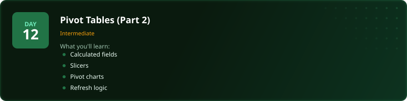
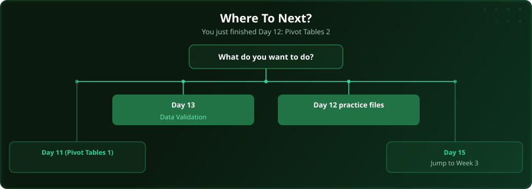

  

  
  
  
  

# Day 12 - Pivot Tables (Part 2)

[<< Day 11: Pivot Tables (Part 1)](../day_11_pivot_tables_1/) | [Day 13: Data Validation >>](../day_13_data_validation/)

---

## What You'll Learn

- Calculated fields for custom metrics
- Slicers for interactive filtering
- Pivot charts for visual summaries
- Refreshing when data changes

---

## Files

Open the example workbook in this folder and follow along with the [video lesson](https://www.youtube.com/watch?v=iyDYuZAMD9A). Then test yourself with the challenge in the [`practice/`](practice/) folder.

---

## Where To Next?

  

---

  <a href="../day_11_pivot_tables_1/">&#9664; Day 11: Pivot Tables (Part 1)</a> &nbsp;&nbsp;|&nbsp;&nbsp; <a href="../day_13_data_validation/">Day 13: Data Validation &#9654;</a>

---

<!-- CLIFFHANGER -->

<b>UP NEXT</b>

<b>Day 13 &nbsp;&middot;&nbsp; Data Validation</b>

<i>Clean data is not glamorous. It is the difference between right and very wrong.</i>

<!-- /CLIFFHANGER -->
