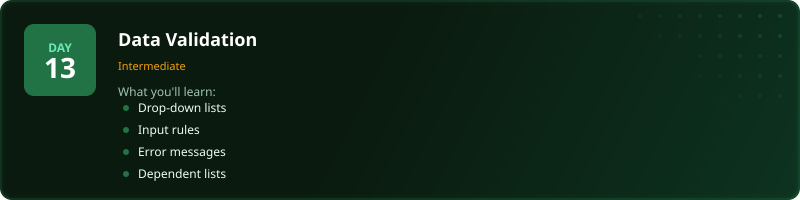
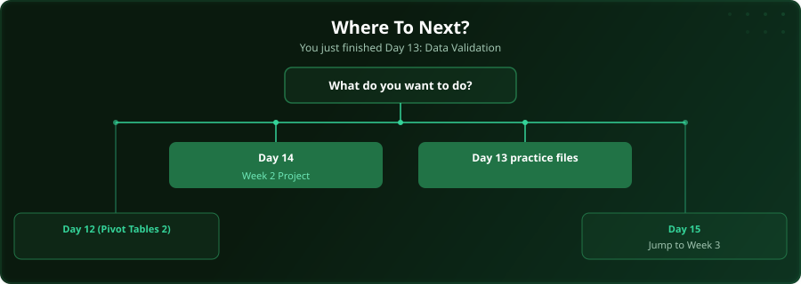

  

  
  
  
  

# Day 13 - Data Validation

[<< Day 12: Pivot Tables (Part 2)](../day_12_pivot_tables_2/) | [Day 14: Project: Week 2 Data Project >>](../day_14_week2_practice/)

---

## What You'll Learn

- Building drop-down lists
- Setting input rules and restrictions
- Custom error messages
- Dependent/cascading lists

---

## Files

Open the files in this folder and follow along with the [video lesson](https://www.youtube.com/watch?v=-Kafb-ypHaM).

---

## Where To Next?

  

---

  <a href="../day_12_pivot_tables_2/">&#9664; Day 12: Pivot Tables (Part 2)</a> &nbsp;&nbsp;|&nbsp;&nbsp; <a href="../day_14_week2_practice/">Day 14: Project: Week 2 Data Project &#9654;</a>

---

<!-- CLIFFHANGER -->

<b>UP NEXT</b>

<b>Day 14 &nbsp;&middot;&nbsp; Project: Week 2 Data Project</b>

<i>The day you stop learning and start building.</i>

<!-- /CLIFFHANGER -->
