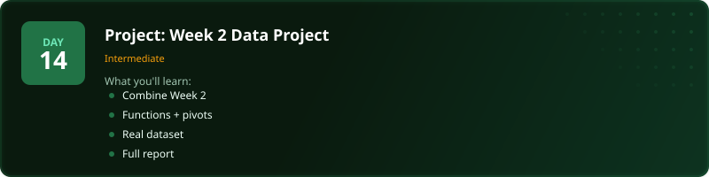
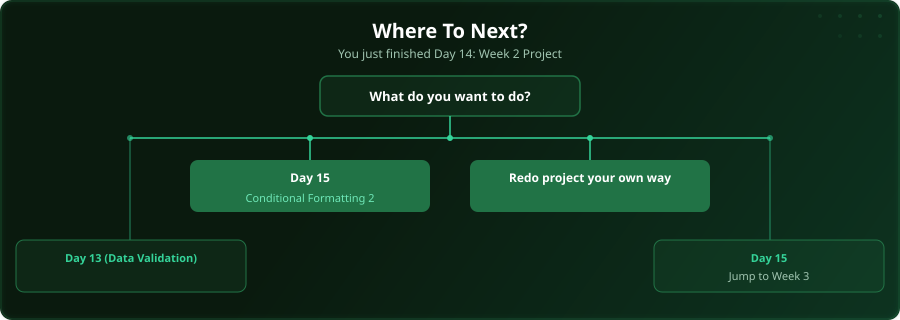

  

  
  
  
  

# Day 14 - Project: Week 2 Data Project

[<< Day 13: Data Validation](../day_13_data_validation/) | [Day 15: Conditional Formatting (Part 2) >>](../day_15_conditional_formatting_2/)

---

## What You'll Learn

- Combine functions and pivot tables
- Work with a real dataset
- Build a complete analytical report
- Present data-driven findings

---

## Files

Open the project workbook in this folder and follow along with the [video lesson](https://www.youtube.com/watch?v=Y_fwPqS0YHs). Then test yourself with the challenge in the [`practice/`](practice/) folder. When you are done, check your work against the solution workbook [`practice/Day14_Practice_Solution.xlsx`](practice/Day14_Practice_Solution.xlsx) in that folder.

---

  

## Where To Next?

  

---

  <a href="../day_13_data_validation/">&#9664; Day 13: Data Validation</a> &nbsp;&nbsp;|&nbsp;&nbsp; <a href="../day_15_conditional_formatting_2/">Day 15: Conditional Formatting (Part 2) &#9654;</a>

---

<!-- CLIFFHANGER -->

<b>UP NEXT</b>

<b>Day 15 &nbsp;&middot;&nbsp; Conditional Formatting (Part 2)</b>

<i>Bad charts hide insight. Good ones force it.</i>

<!-- /CLIFFHANGER -->
