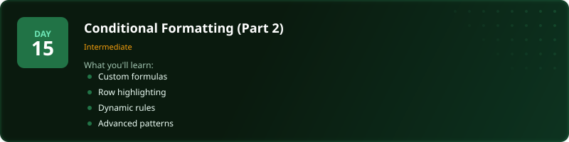
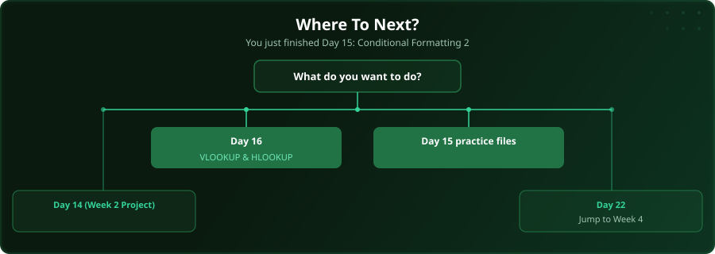

  

  
  
  
  

# Day 15 - Conditional Formatting (Part 2)

[<< Day 14: Project: Week 2 Data Project](../day_14_week2_practice/) | [Day 16: VLOOKUP & HLOOKUP >>](../day_16_vlookup_hlookup/)

---

## What You'll Learn

- Custom formula-based rules
- Highlighting entire rows
- Dynamic conditional formatting
- Advanced pattern matching

---

## Files

Open the example workbook in this folder and follow along with the [video lesson](https://www.youtube.com/watch?v=q5IrQWp_Z8E). Then test yourself with the challenge in the [`practice/`](practice/) folder. When you are done, check your work against the solution workbook [`practice/Day15_Practice_Solution.xlsx`](practice/Day15_Practice_Solution.xlsx) in that folder.

---

  

## Where To Next?

  

---

  <a href="../day_14_week2_practice/">&#9664; Day 14: Project: Week 2 Data Project</a> &nbsp;&nbsp;|&nbsp;&nbsp; <a href="../day_16_vlookup_hlookup/">Day 16: VLOOKUP & HLOOKUP &#9654;</a>

---

<!-- CLIFFHANGER -->

<b>UP NEXT</b>

<b>Day 16 &nbsp;&middot;&nbsp; VLOOKUP & HLOOKUP</b>

<i>Lookups separate the spreadsheet person from everyone else.</i>

<!-- /CLIFFHANGER -->
