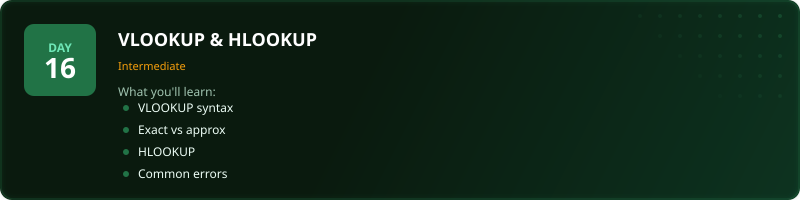
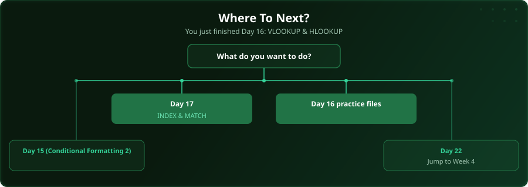

  

  
  
  
  

# Day 16 - VLOOKUP & HLOOKUP

[<< Day 15: Conditional Formatting (Part 2)](../day_15_conditional_formatting_2/) | [Day 17: INDEX & MATCH >>](../day_17_index_match/)

---

## What You'll Learn

- VLOOKUP syntax and logic
- Exact vs approximate matching
- HLOOKUP for horizontal lookups
- Common VLOOKUP errors and fixes

---

## Files

Open the files in this folder and follow along with the [video lesson](https://www.youtube.com/watch?v=G6_TYOiv1wg).

---

## Where To Next?

  

---

  <a href="../day_15_conditional_formatting_2/">&#9664; Day 15: Conditional Formatting (Part 2)</a> &nbsp;&nbsp;|&nbsp;&nbsp; <a href="../day_17_index_match/">Day 17: INDEX & MATCH &#9654;</a>

