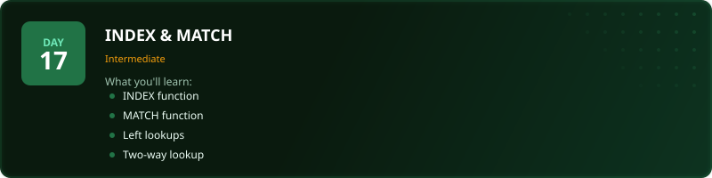
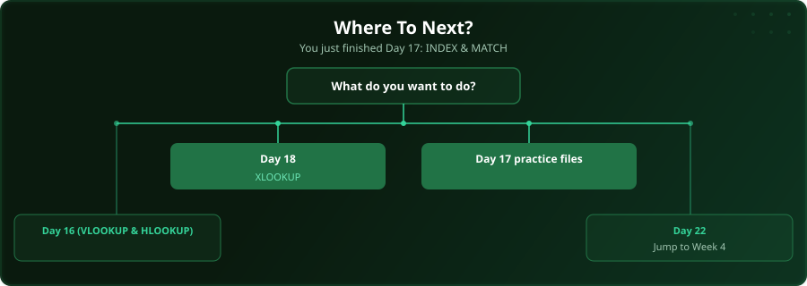

  

  
  
  
  

# Day 17 - INDEX & MATCH

[<< Day 16: VLOOKUP & HLOOKUP](../day_16_vlookup_hlookup/) | [Day 18: XLOOKUP >>](../day_18_xlookup/)

---

## What You'll Learn

- INDEX for returning values
- MATCH for finding positions
- Left lookups (VLOOKUP cannot do this)
- Two-way lookups

---

## Files

Open the files in this folder and follow along with the [video lesson](https://www.youtube.com/watch?v=mqtgqlj6QMc).

---

## Where To Next?

  

---

  <a href="../day_16_vlookup_hlookup/">&#9664; Day 16: VLOOKUP & HLOOKUP</a> &nbsp;&nbsp;|&nbsp;&nbsp; <a href="../day_18_xlookup/">Day 18: XLOOKUP &#9654;</a>

---

<!-- CLIFFHANGER -->

<b>UP NEXT</b>

<b>Day 18 &nbsp;&middot;&nbsp; XLOOKUP</b>

<i>Lookups separate the spreadsheet person from everyone else.</i>

<!-- /CLIFFHANGER -->
