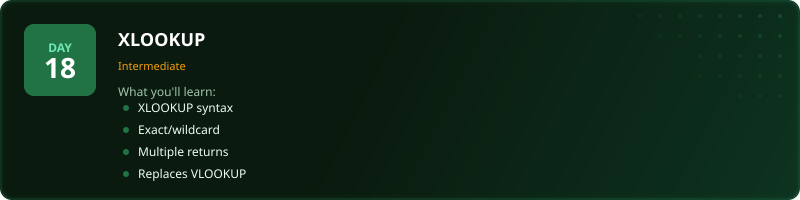
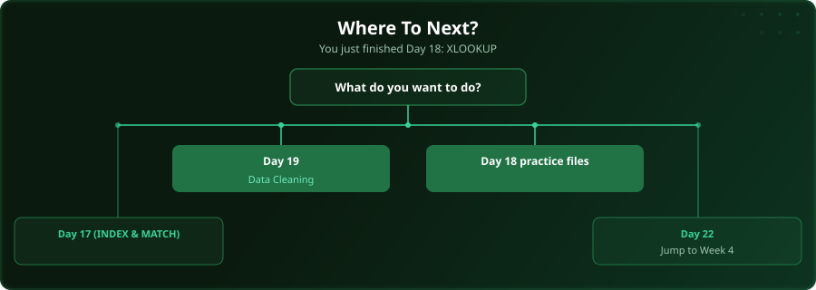

  

  
  
  
  

# Day 18 - XLOOKUP

[<< Day 17: INDEX & MATCH](../day_17_index_match/) | [Day 19: Data Cleaning >>](../day_19_data_cleaning/)

---

## What You'll Learn

- XLOOKUP syntax (simpler than VLOOKUP)
- Exact match, wildcard, approximate
- Returning multiple columns
- Why XLOOKUP replaces VLOOKUP

---

## Files

Open the files in this folder and follow along with the [video lesson](https://www.youtube.com/watch?v=vJf5CWBtA_4).

---

## Where To Next?

  

---

  <a href="../day_17_index_match/">&#9664; Day 17: INDEX & MATCH</a> &nbsp;&nbsp;|&nbsp;&nbsp; <a href="../day_19_data_cleaning/">Day 19: Data Cleaning &#9654;</a>

---

<!-- CLIFFHANGER -->

<b>UP NEXT</b>

<b>Day 19 &nbsp;&middot;&nbsp; Data Cleaning</b>

<i>Clean data is not glamorous. It is the difference between right and very wrong.</i>

<!-- /CLIFFHANGER -->
