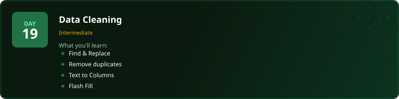
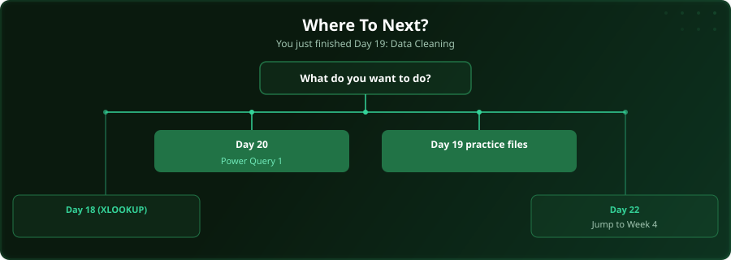

  

  
  
  
  

# Day 19 - Data Cleaning

[<< Day 18: XLOOKUP](../day_18_xlookup/) | [Day 20: Power Query (Part 1) >>](../day_20_power_query_1/)

---

## What You'll Learn

- Find & Replace for bulk fixes
- Remove Duplicates
- Text to Columns for splitting data
- Flash Fill for pattern-based extraction

---

## Files

Open the files in this folder and follow along with the [video lesson](https://www.youtube.com/watch?v=RgAOED78C-E).

---

## Where To Next?

  

---

  <a href="../day_18_xlookup/">&#9664; Day 18: XLOOKUP</a> &nbsp;&nbsp;|&nbsp;&nbsp; <a href="../day_20_power_query_1/">Day 20: Power Query (Part 1) &#9654;</a>

---

<!-- CLIFFHANGER -->

<b>UP NEXT</b>

<b>Day 20 &nbsp;&middot;&nbsp; Power Query (Part 1)</b>

<i>Where Excel stops being a spreadsheet and starts being a database.</i>

<!-- /CLIFFHANGER -->
