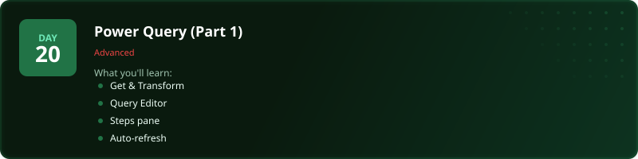
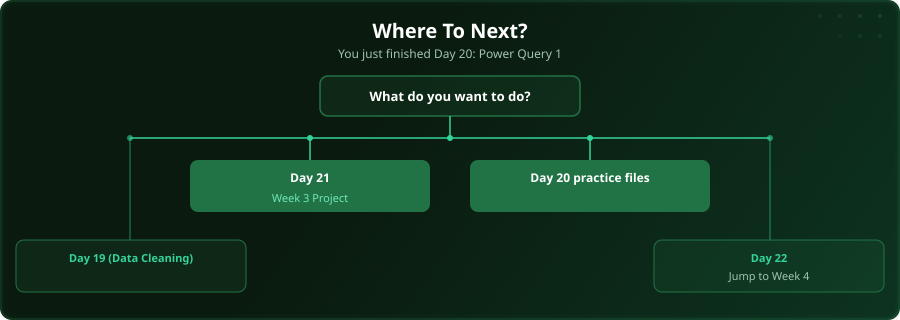

  

  
  
  
  

# Day 20 - Power Query (Part 1)

[<< Day 19: Data Cleaning](../day_19_data_cleaning/) | [Day 21: Project: Week 3 Data Project >>](../day_21_week3_practice/)

---

## What You'll Learn

- Get & Transform data sources
- Query Editor interface
- Applied Steps pane
- Auto-refresh on data changes

---

## Files

Open the example workbook in this folder and follow along with the [video lesson](https://www.youtube.com/watch?v=R1M2p3kV9mo). Then test yourself with the challenge in the [`practice/`](practice/) folder. When you are done, check your work against the solution workbook [`practice/Day20_Practice_Solution.xlsx`](practice/Day20_Practice_Solution.xlsx) in that folder.

---

  

## Where To Next?

  

---

  <a href="../day_19_data_cleaning/">&#9664; Day 19: Data Cleaning</a> &nbsp;&nbsp;|&nbsp;&nbsp; <a href="../day_21_week3_practice/">Day 21: Project: Week 3 Data Project &#9654;</a>

---

<!-- CLIFFHANGER -->

<b>UP NEXT</b>

<b>Day 21 &nbsp;&middot;&nbsp; Project: Week 3 Data Project</b>

<i>The day you stop learning and start building.</i>

<!-- /CLIFFHANGER -->
