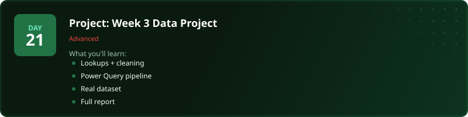
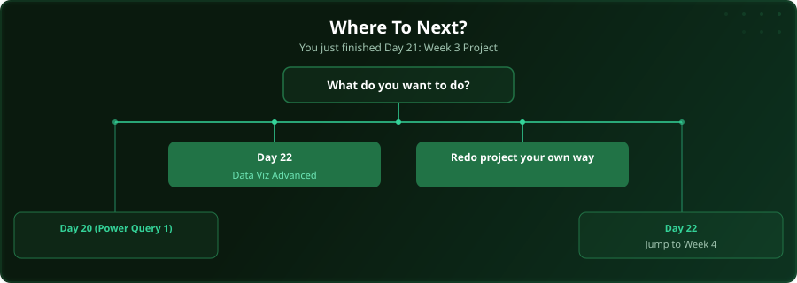

  

  
  
  
  

# Day 21 - Project: Week 3 Data Project

[<< Day 20: Power Query (Part 1)](../day_20_power_query_1/) | [Day 22: Data Visualisation (Advanced) >>](../day_22_data_viz_advanced/)

---

## What You'll Learn

- Lookups + data cleaning combined
- Power Query pipeline
- Work with a real dataset
- Build a polished output

---

## Files

Open the files in this folder and follow along with the [video lesson](https://www.youtube.com/watch?v=J7YeXpfXTxI).

---

  

## Where To Next?

  

---

  <a href="../day_20_power_query_1/">&#9664; Day 20: Power Query (Part 1)</a> &nbsp;&nbsp;|&nbsp;&nbsp; <a href="../day_22_data_viz_advanced/">Day 22: Data Visualisation (Advanced) &#9654;</a>

---

<!-- CLIFFHANGER -->

<b>UP NEXT</b>

<b>Day 22 &nbsp;&middot;&nbsp; Data Visualisation (Advanced)</b>

<i>Bad charts hide insight. Good ones force it.</i>

<!-- /CLIFFHANGER -->
