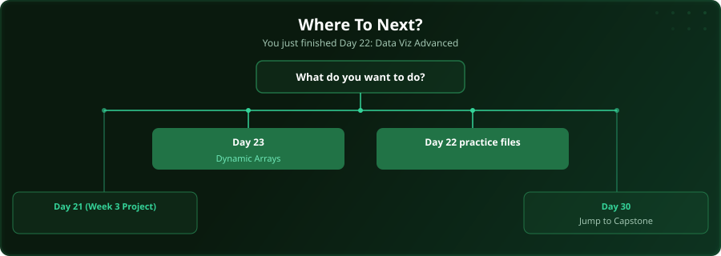

  

  
  
  
  

# Day 22 - Data Visualisation (Advanced)

[<< Day 21: Project: Week 3 Data Project](../day_21_week3_practice/) | [Day 23: Dynamic Array Functions >>](../day_23_dynamic_arrays_text/)

---

## What You'll Learn

- Combo charts for dual-axis data
- Sparklines for inline trends
- Dynamic chart ranges
- Dashboard layout principles

---

## Files

Open the example workbook in this folder and follow along with the [video lesson](https://www.youtube.com/watch?v=FuTsKAqN3NY). Then test yourself with the challenge in the [`practice/`](practice/) folder.

---

## Where To Next?

  

---

  <a href="../day_21_week3_practice/">&#9664; Day 21: Project: Week 3 Data Project</a> &nbsp;&nbsp;|&nbsp;&nbsp; <a href="../day_23_dynamic_arrays_text/">Day 23: Dynamic Array Functions &#9654;</a>

---

<!-- CLIFFHANGER -->

<b>UP NEXT</b>

<b>Day 23 &nbsp;&middot;&nbsp; Dynamic Array Functions</b>

<i>One formula. A whole spilled range. The future of Excel.</i>

<!-- /CLIFFHANGER -->
