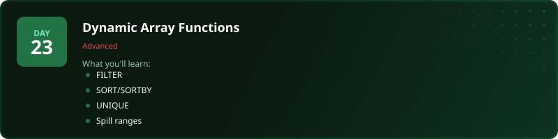
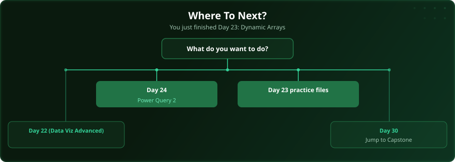

  

  
  
  
  

# Day 23 - Dynamic Array Functions

[<< Day 22: Data Visualisation (Advanced)](../day_22_data_viz_advanced/) | [Day 24: Power Query (Part 2) >>](../day_24_power_query_2/)

---

## What You'll Learn

- FILTER for live-updating subsets
- SORT and SORTBY
- UNIQUE for distinct values
- Spill ranges and # references

---

## Files

Open the files in this folder and follow along with the [video lesson](https://www.youtube.com/watch?v=YykiAwglQFQ).

---

## Where To Next?

  

---

  <a href="../day_22_data_viz_advanced/">&#9664; Day 22: Data Visualisation (Advanced)</a> &nbsp;&nbsp;|&nbsp;&nbsp; <a href="../day_24_power_query_2/">Day 24: Power Query (Part 2) &#9654;</a>

