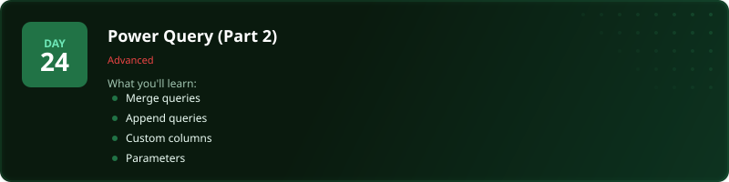
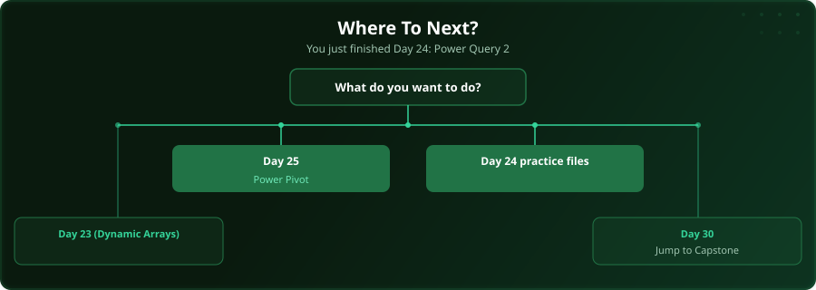

  

  
  
  
  

# Day 24 - Power Query (Part 2)

[<< Day 23: Dynamic Array Functions](../day_23_dynamic_arrays_text/) | [Day 25: Power Pivot & DAX >>](../day_25_power_pivot/)

---

## What You'll Learn

- Merge queries (like SQL JOINs)
- Append queries (like SQL UNION)
- Custom columns with M language
- Parameters for reusable queries

---

## Files

Open the files in this folder and follow along with the [video lesson](https://www.youtube.com/watch?v=JZs-nMaiaPI).

---

## Where To Next?

  

---

  <a href="../day_23_dynamic_arrays_text/">&#9664; Day 23: Dynamic Array Functions</a> &nbsp;&nbsp;|&nbsp;&nbsp; <a href="../day_25_power_pivot/">Day 25: Power Pivot & DAX &#9654;</a>

---

<!-- CLIFFHANGER -->

<b>UP NEXT</b>

<b>Day 25 &nbsp;&middot;&nbsp; Power Pivot & DAX</b>

<i>Pivot tables eat hours of manual work in seconds.</i>

<!-- /CLIFFHANGER -->
