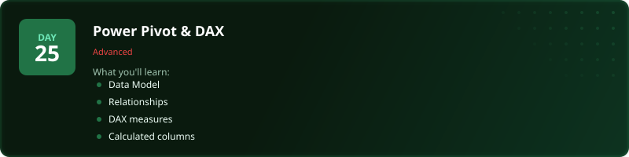
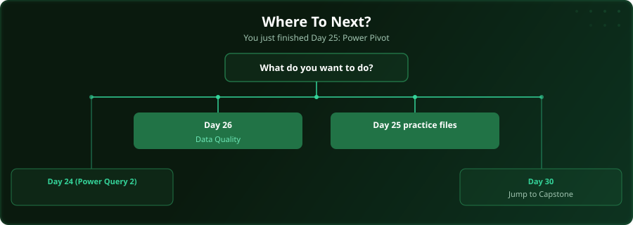

  

  
  
  
  

# Day 25 - Power Pivot & DAX

[<< Day 24: Power Query (Part 2)](../day_24_power_query_2/) | [Day 26: Data Quality & Auditing >>](../day_26_data_quality_auditing/)

---

## What You'll Learn

- Building a Data Model
- Creating table relationships
- Writing DAX measures
- Calculated columns vs measures

---

## Files

Open `day25_examples.xlsx` (plus the numbered `day25_example_3/4/5.xlsx` builds) alongside the [video lesson](https://www.youtube.com/watch?v=oD7HE3W8EuY); the CSV data each model imports is in [`datasets/`](datasets/). Then test yourself with the challenge in the [`practice/`](practice/) folder.

---

  

## Where To Next?

  

---

  <a href="../day_24_power_query_2/">&#9664; Day 24: Power Query (Part 2)</a> &nbsp;&nbsp;|&nbsp;&nbsp; <a href="../day_26_data_quality_auditing/">Day 26: Data Quality & Auditing &#9654;</a>

---

<!-- CLIFFHANGER -->

<b>UP NEXT</b>

<b>Day 26 &nbsp;&middot;&nbsp; Data Quality & Auditing</b>

<i>Clean data is not glamorous. It is the difference between right and very wrong.</i>

<!-- /CLIFFHANGER -->
