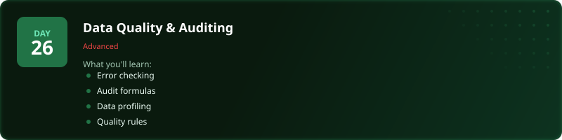
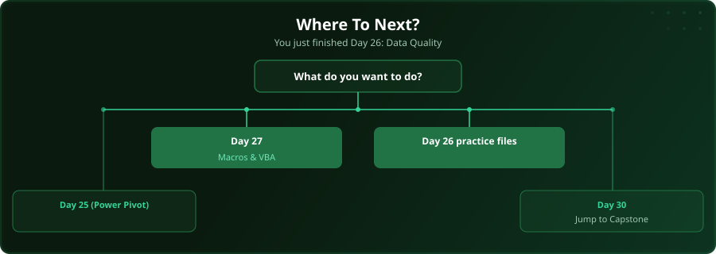

  

  
  
  
  

# Day 26 - Data Quality & Auditing

[<< Day 25: Power Pivot & DAX](../day_25_power_pivot/) | [Day 27: Macros & VBA Automation >>](../day_27_macros_automation/)

---

## What You'll Learn

- Error checking tools
- Formula auditing (Trace Precedents/Dependents)
- Data profiling techniques
- Quality rules and validation

---

## Files

Open the example workbook in this folder and follow along with the [video lesson](https://www.youtube.com/watch?v=jvjCL3Ht0RQ). Then test yourself with the challenge in the [`practice/`](practice/) folder. When you are done, check your work against the solution workbook [`practice/Day26_Practice_Solution.xlsx`](practice/Day26_Practice_Solution.xlsx) in that folder.

---

## Where To Next?

  

---

  <a href="../day_25_power_pivot/">&#9664; Day 25: Power Pivot & DAX</a> &nbsp;&nbsp;|&nbsp;&nbsp; <a href="../day_27_macros_automation/">Day 27: Macros & VBA Automation &#9654;</a>

---

<!-- CLIFFHANGER -->

<b>UP NEXT</b>

<b>Day 27 &nbsp;&middot;&nbsp; Macros & VBA Automation</b>

<i>Automate it once. Save the time forever.</i>

<!-- /CLIFFHANGER -->
