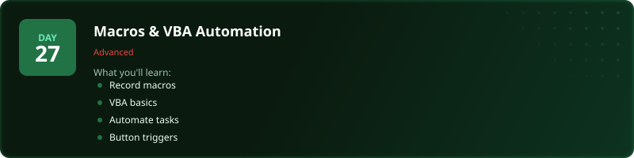
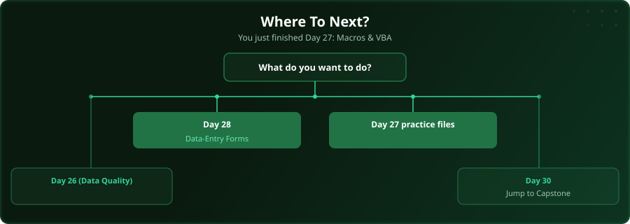

  

  
  
  
  

# Day 27 - Macros & VBA Automation

[<< Day 26: Data Quality & Auditing](../day_26_data_quality_auditing/) | [Day 28: Building a Data-Entry Form >>](../day_28_data_entry_forms/)

---

## What You'll Learn

- Recording your first macro
- VBA basics and the Editor
- Automating repetitive tasks
- Assigning macros to buttons

---

## Files

Open the files in this folder and follow along with the [video lesson](https://www.youtube.com/watch?v=LVPJCpfrd54).

---

## Where To Next?

  

---

  <a href="../day_26_data_quality_auditing/">&#9664; Day 26: Data Quality & Auditing</a> &nbsp;&nbsp;|&nbsp;&nbsp; <a href="../day_28_data_entry_forms/">Day 28: Building a Data-Entry Form &#9654;</a>

