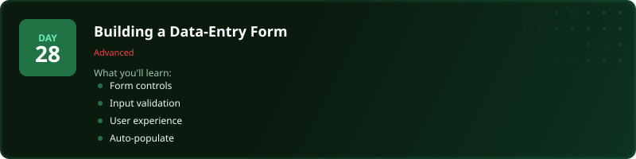
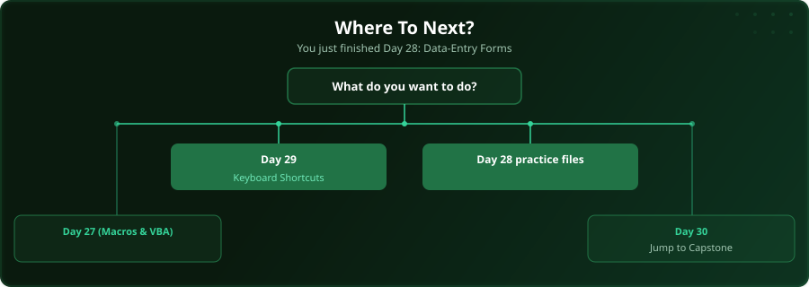

  

  
  
  
  

# Day 28 - Building a Data-Entry Form

[<< Day 27: Macros & VBA Automation](../day_27_macros_automation/) | [Day 29: Keyboard Shortcuts >>](../day_29_useful_shortcuts/)

---

## What You'll Learn

- Form controls and layout
- Input validation on forms
- User-friendly design
- Auto-populating fields

---

## Files

Open the files in this folder and follow along with the [video lesson](https://www.youtube.com/watch?v=zQoKK_-0vUk).

---

## Where To Next?

  

---

  <a href="../day_27_macros_automation/">&#9664; Day 27: Macros & VBA Automation</a> &nbsp;&nbsp;|&nbsp;&nbsp; <a href="../day_29_useful_shortcuts/">Day 29: Keyboard Shortcuts &#9654;</a>

---

<!-- CLIFFHANGER -->

<b>UP NEXT</b>

<b>Day 29 &nbsp;&middot;&nbsp; Keyboard Shortcuts</b>

<i>The shortcuts pros use without thinking. You will too.</i>

<!-- /CLIFFHANGER -->
