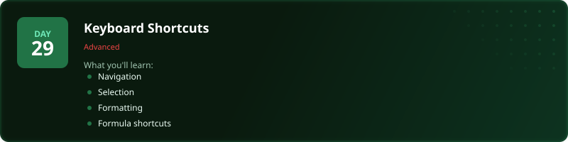
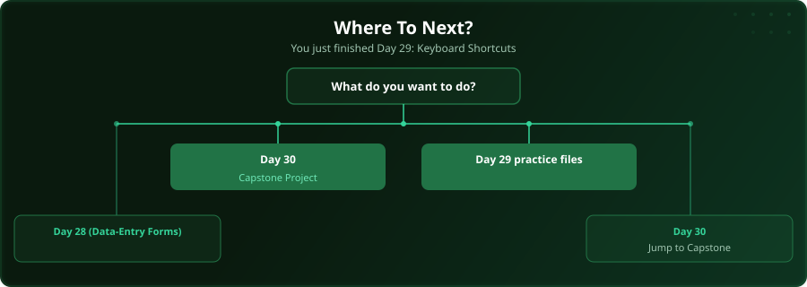

  

  
  
  
  

# Day 29 - Keyboard Shortcuts

[<< Day 28: Building a Data-Entry Form](../day_28_data_entry_forms/) | [Day 30: Capstone: Final Data Project >>](../day_30_final_project/)

---

## What You'll Learn

- Navigation shortcuts
- Selection shortcuts
- Formatting shortcuts
- Formula shortcuts

---

## Files

Open the files in this folder and follow along with the [video lesson](https://www.youtube.com/watch?v=hNgZAPLCjwo).

---

## Where To Next?

  

---

  <a href="../day_28_data_entry_forms/">&#9664; Day 28: Building a Data-Entry Form</a> &nbsp;&nbsp;|&nbsp;&nbsp; <a href="../day_30_final_project/">Day 30: Capstone: Final Data Project &#9654;</a>

