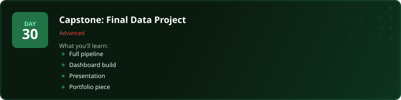
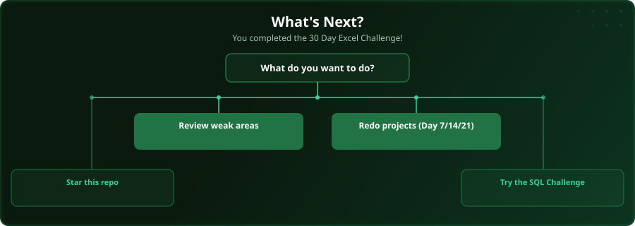

  

  
  
  
  

# Day 30 - Capstone: Final Data Project

[<< Day 29: Keyboard Shortcuts](../day_29_useful_shortcuts/) | Challenge complete!

---

## What You'll Learn

- Full data pipeline
- Dashboard build
- Presentation-ready output
- Portfolio piece

---

## Files

The project workbooks are in [`exercise/`](exercise/) (`day30_final_project.xlsx` and `data_model_planning.xlsx`) and the source data is in [`datasets/`](datasets/). Open them alongside the [video lesson](https://www.youtube.com/watch?v=lz_JA_t_DSg), then test yourself with the challenge in the [`practice/`](practice/) folder.

---

  

## Where To Next?

  

---

  <a href="../day_29_useful_shortcuts/">&#9664; Day 29: Keyboard Shortcuts</a>

---

<!-- CLIFFHANGER -->

<b>YOU DID IT</b>

<b>All 30 days.</b> That's the challenge done.

<i>Now build something with it.</i>

<a href="../README.md">&larr; Back to the curriculum</a>

<!-- /CLIFFHANGER -->
