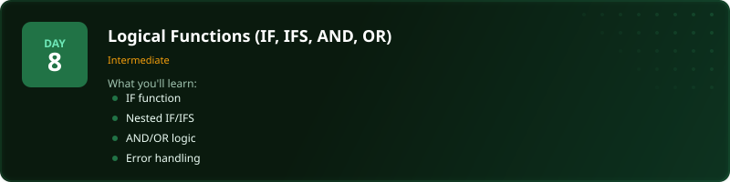

<p align="center">
  <a href="../README.md"></a>
</p>

<p align="center">
  <a href="../README.md"></a>
  <a href="why-this-challenge.md"></a>
</p>

# Where Should I Start?

Not everyone is starting from zero - and the challenge is designed for that. Whether you've never opened a spreadsheet or you're an analyst who wants to sharpen your dashboarding skills, there's a starting point that makes sense for you.

Pick the one that sounds like you.

---

## "I've never used Excel before"

<p align="center">
  <a href="../day_01_getting_started/"></a>
</p>

**Start at [Day 1](../day_01_getting_started/).**

You'll open Excel for the first time, learn how worksheets and workbooks are structured, and enter your first formulas. No prior knowledge needed - we start from literally nothing.

**What you'll cover in Week 1 (Days 1-7):**
- How spreadsheets store data in rows, columns, and cells
- How to write basic formulas: SUM, AVERAGE, MIN, MAX, COUNT
- Formatting, sorting, and filtering your data
- Cell references - relative, absolute, and mixed
- Named ranges and basic data validation
- A full project pulling everything together

**Why start here:** If you skip the fundamentals, everything after Day 7 builds on shaky ground. Week 1 is quick - most people finish each day in 20-30 minutes. It's worth doing even if some of it feels basic, because the exercises are where the real learning happens.

**You'll be ready for Week 2 by:** Day 8, about a week in.

---

## "I know the basics but I'm rusty on functions"

<p align="center">
  <a href="../day_08_logical_functions/"></a>
</p>

**Start at [Day 8](../day_08_logical_functions/).**

You can enter data and write a SUM, but the intermediate stuff - IF statements, text functions, date calculations, COUNTIF - is either rusty or you never properly learnt it.

**What you'll cover in Week 2 (Days 8-14):**
- Logical functions: IF, AND, OR, NOT
- Text functions for cleaning and transforming string data
- Date and time functions for calculations and formatting
- COUNTIF, SUMIF, and AVERAGEIF for conditional aggregation
- Error handling with IFERROR and IFNA
- Named ranges and structured table references
- A full project using everything above

**Why start here:** This is the stuff that separates "I know some Excel" from "I'm comfortable with Excel." Most people in data-adjacent roles use these functions daily but learnt them haphazardly. Week 2 gives you proper foundations for the patterns you'll use most.

**If you get stuck:** Drop back to the specific Day 1-7 topic you need. Each day's README has a "Where To Next?" section that points you to the right refresher.

---

## "I'm comfortable but I've never properly learnt lookups"

<p align="center">
  <a href="../day_15_conditional_formatting_2/"></a>
</p>

**Start at [Day 15](../day_15_conditional_formatting_2/).**

You can write formulas confidently on a single sheet, but the moment someone says "pull that value from the other tab" you're guessing. Or you use VLOOKUP because someone showed you once, without understanding what it actually does or when it breaks.

**What you'll cover in Week 3 (Days 15-21):**
- Advanced conditional formatting - rules, scales, and icon sets
- VLOOKUP and HLOOKUP - what they do and where they fall short
- XLOOKUP and INDEX-MATCH for flexible, robust lookups
- Multi-condition lookups and approximate matching
- Cross-sheet and cross-workbook references
- Introduction to pivot tables for summary analysis
- A full multi-sheet reporting project

**Why start here:** Lookups are the single most important skill that separates spreadsheet users from spreadsheet builders. Every real workbook pulls data from somewhere. If you can't connect sheets confidently, you can't answer real business questions. This week fixes that.

**Prerequisites:** You should be comfortable with IF statements, COUNTIF/SUMIF, and basic text and date functions. If any of those feel unfamiliar, do Days 8-10 first.

---

## "I already use Excel at work - give me the advanced stuff"

<p align="center">
  <a href="../day_22_data_viz_advanced/"></a>
</p>

**Start at [Day 22](../day_22_data_viz_advanced/).**

You use Excel daily. You can write VLOOKUP, build pivot tables, handle IFs. But advanced charting still feels clunky, you've never used Power Query, and your dashboards don't look the way you want them to. This is where you level up.

**What you'll cover in Week 4 (Days 22-30):**
- Advanced data visualisation: combination charts, dynamic ranges, sparklines
- Dashboard design principles - layout, colour, and readability
- Power Query for automated data cleaning and transformation
- Dynamic arrays: FILTER, SORT, UNIQUE, and SEQUENCE
- What-if analysis: Goal Seek, Scenario Manager, and Data Tables
- Protecting and auditing workbooks for production use
- A full capstone: financial operations dashboard with live data connections

**Why start here:** This is production-grade Excel. The stuff that gets you noticed - dashboards that update automatically, reports that don't need manual cleanup every week, workbooks that other people can actually use. Dynamic arrays alone change how you think about spreadsheet design.

**Prerequisites:** Comfortable with lookups, pivot tables, and conditional formulas. If any of those feel shaky, do the relevant days first - each one is self-contained.

---

## Still not sure?

Here's a quick test. Look at this formula:

```excel
=SUMIFS(Revenue[Amount], Revenue[Region], "North", Revenue[Status], "Closed")
```

- **No idea what that means?** Start at [Day 1](../day_01_getting_started/).
- **Understand it but couldn't write it from scratch?** Start at [Day 8](../day_08_logical_functions/).
- **Could write it easily but not sure how to pull matching rows from another sheet?** Start at [Day 15](../day_15_conditional_formatting_2/).
- **Could do all of that but your dashboards still look like a spreadsheet?** Start at [Day 22](../day_22_data_viz_advanced/).

---

## Every day connects to the next

No matter where you start, each day's README has a **"Where To Next?"** navigation tree at the bottom showing you:

- The natural next lesson
- Where to apply what you just learnt (exercises or projects)
- Where to brush up if something felt shaky
- Where to skip ahead if you want a fresh topic

You can't get lost. Every page tells you where to go next.

---

<p align="center">
  <a href="../day_01_getting_started/"></a>
  &nbsp;&nbsp;
  <a href="../day_08_logical_functions/"></a>
  &nbsp;&nbsp;
  <a href="../day_15_conditional_formatting_2/"></a>
  &nbsp;&nbsp;
  <a href="../day_22_data_viz_advanced/"></a>
</p>

---

One more thing - this entire challenge is free. Every video, every dataset, every solution. If it helps you get where you want to go, [subscribe on YouTube](https://www.youtube.com/@sdw-online?sub_confirmation=1) so Stephen can keep making these. It takes one click and it means more free challenges for everyone.

<p align="center">
  <a href="https://www.youtube.com/@sdw-online?sub_confirmation=1"></a>
</p>
